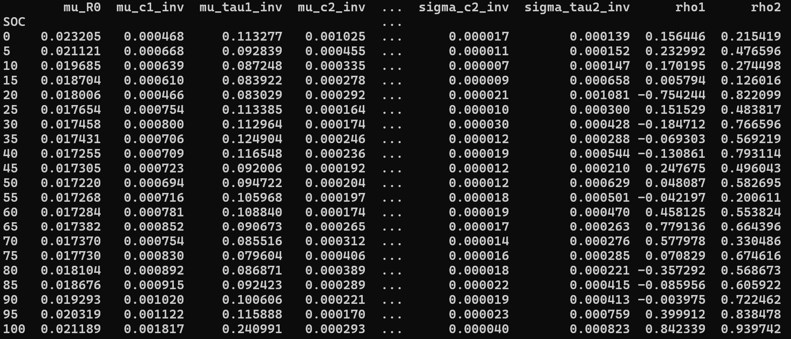

# Probabilistic Modelling for Batteries

## Formatting of parquets in data/distributions
---
Data containing the necessary parameter distributions for interpolation are stored in [data/distributions](data/distributions). The default naming scheme is `temperature +'deg.parquet'`. This can be changed if needed, however make sure to adjust the following functions:
- `BatteryParameterInterpolator._load_distribution` in [interpolators.py](gaussian_process/interpolators.py)
---

Below is an example of the currently expected file contents:

If you have configured a custom file structure in [compile_distributions.py](matlab_parameter_estimator/compile_distributions.py), please also define how its contents should be parsed in [parameter_loader.py](utils/parameter_loader.py). You are also free to define your own variable names, which will be assigned to their respective interpolators by the method `BatteryParameterInterpolator._set_data()`. Note, however, that the models in [ecm.py](models/ecm.py) expect certain naming schemes. For example, `GalerkinPCE` method expects the following variable names:
- `mu_tau1_inv`, `sigma_tau1_inv`
- `mu_c1_inv`, `sigma_c1_inv`
- `mu_tau2_inv`, `sigma_tau2_inv`
- `mu_c2_inv`, `sigma_c2_inv`
- `rho1`, `rho2`

You can either stick to those or tweak the model implementation to match your own (more work).
